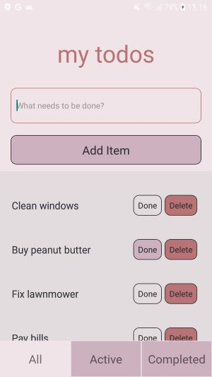
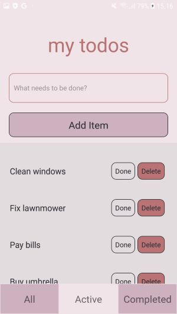
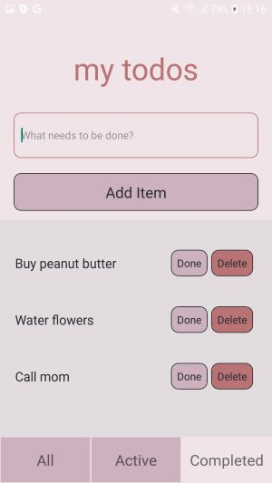

# ToDoApp

This is a simple ToDoApp, made with React Native. It was originally a study assignment. The app has been tested on an android phone with Android 8.0.0 (Api level 25 ) and an emulator with Android 12.0.0

You can add items to your todo list, mark them done or delete them. You can choose to see all items, active items or completed items.


*Showing all todos.*


*Showing active todos.*


*Showing completed todos.*


## Installation
1. Clone the repository:
```bash
 git clone https://github.com/apursio/ToDoApp.git
```

2. Install dependencies:
```bash
 npm install
 ```

## Usage
To run the project on an android device connected to your computer, use the following command:
```bash
npm run android
```

## License
This project is licensed under the [MIT License](LICENSE).